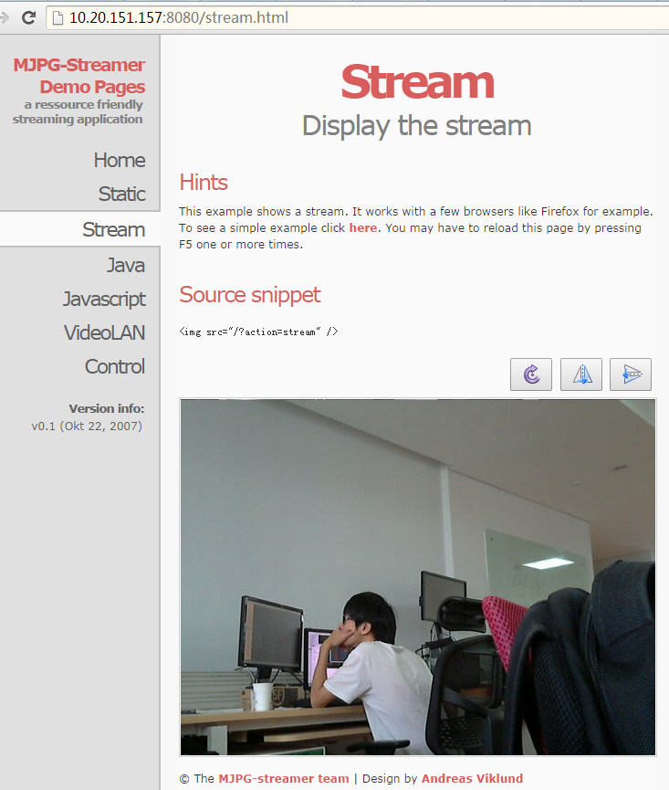

Raspberry-Pi 树莓派-摄像头篇
============
# 一、硬件
 
 - 罗技C270 - 带麦的。
 - 无牌子的，20～30元的烂货
 
# 二、软件

    网上搜索到是 motion 与 mjpg-streamer， 两者都有HTTP功能。直接apt-get安装。

## 2.1 关于[motion](http://pingbin.com/2012/12/raspberry-pi-web-cam-server-motion/)
- 可使用apt-get安装
- 配置项很多。
- 使用中CPU占用很高，我使用Chrome最新版，没法显示出图像，使用Pi内置的浏览器可以。
- 手机可使用 [iCamViewer](https://itunes.apple.com/ca/app/icamviewer-cctv-camera-ip/id346469891?mt=8) 查看
- 无声音
- 最终没成功看到视频，使用iCrameraViewer, VLC也不行。

## 2.2 关于 mjpg-streamer
- 没apt-get源，有二进制包，下载解压即用。
- [源码在此](https://svn.code.sf.net/p/mjpg-streamer/code/mjpg-streamer/)，(编译方式在此)(https://github.com/meinside/rpi-mjpg-streamer),   网上源码分支太多了，有些编译过。
- 配置很简单，所以没motion功能或强, github上有很多fork
- CPU占用不高。
- 启动后可直接 Chrome访问，有页面版，也可使用[Video Lan Client播放器](http://www.videolan.org/vlc/index.html)直接播放
- 局域网很流畅，流量比较大，延迟在1～2秒间。
- 无声音
- 杂牌摄像头报错：`The inpout device does not supports MJPEG mode` -- 不能用。 
- 效果：
  

#TODO 决定fork一个mjpg-streamer出来看看代码。
