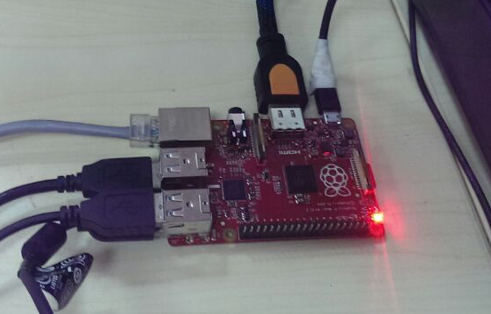

Raspberry-Pi 树莓派
============

最近淘宝了一个`红色`树莓派 B+，记录一下过程。

- 价格RMB 199 ，裸机不包邮，没配置，没外壳。
- [中文说明书](Raspberry_Pi_B.pdf), 是B型，没找到B+型的说明书，B+比B多了2个USB口共4个
- 买了后才知道`红色`的派没`蓝色`的好；说蓝色才是正统之类。红色质量不好，没过流保护等。
- 安装系统:看说明书一步步来就可以。 SD卡自备，电源自备。

OS配置
-----
### 0、启用root用户：
    
	sodu passwd root
	sudo passwd --unlock root

### 一、8021x_authentication
公司的网络连接需要证书+用户+密码, 参考下面文章:  

- [8021x_authentication](http://www.nowiressecurity.com/articles/configure_8021x_authentication_in_linux.htm)
- [www.raspberrypi.org](http://www.raspberrypi.org/forums/viewtopic.php?f=26&t=16729)

我测试使用的是有线连接，配置如下:

root@raspberrypi:# cat /etc/wpa_supplicant.wired.conf 

    ctrl_interface=/var/run/wpa_supplicant
    ctrl_interface_group=root
    ap_scan=0
    network={
    key_mgmt=IEEE8021X
    eap=PEAP
    identity="huangchuantong"
    password="abc123"
    ca_cert="/etc/ca.cer"
    phase1="peaplabel=0"
    phase2="auth=MSCHAPV2"
    }
    
root@raspberrypi:# cat 802wired.sh 
    #!/bin/bash
    ifconfig eth0 up
    ifconfig eth0 promisc
    wpa_supplicant -i eth0 -d -Dwired -c /etc/wpa_supplicant.wired.conf&
    sleep 1
    wpa_gui&
    dhcpcd -do eth0
    
运行此802wired.sh 会把GUI界面跳出来。点击连接就可以了。

### 二、软件源 --  [使用中国科学技术大学的源,帮助文档在此](https://lug.ustc.edu.cn/wiki/mirrors/help/raspbian)

    root@raspberrypi:# cat /etc/apt/sources.list
    deb http://mirrors.ustc.edu.cn/raspbian/raspbian/ wheezy main non-free contrib
    deb-src http://mirrors.ustc.edu.cn/raspbian/raspbian/ wheezy main non-free contrib

### 三、编译了好的openresty

- 先编译安装好openssl-1.0.1i，编译项为

	config --prefix=/usr/local --openssldir=/usr/local/openssl shared

- 安装pcre

	apt-get install libpcre++

- openresty编译项为：

	./configure --prefix=/usr/local/openresty --with-pcre  --with-pcre-jit --with-http_stub_status_module --with-luajit

- 备份一个[编译好的二进制包](openresty-1.7.0.1.bin.tar.gz)，编译过程耗时太长了。
- nginx本身是静态编译，同类系统，copy过去就可以运行的。
- 编译的系统是 Debian-2014-09-09-wheezy-raspbian.img

	root@raspberrypi:/home/pi# uname -a
	Linux raspberrypi 3.12.28+ #709 PREEMPT Mon Sep 8 15:28:00 BST 2014 armv6l GNU/Linux
	

使用感受
-----
1. 慢。 CPU不给力
2. USB口真是越多越好。也是当时买B+考虑点。
3. 发热量感觉不大，在编译[openresty](http://openresty.org/)，几个小时，手能摸
4. [摄像头-- 要独立一篇讲讲](Pi-WebCamare.md)。
